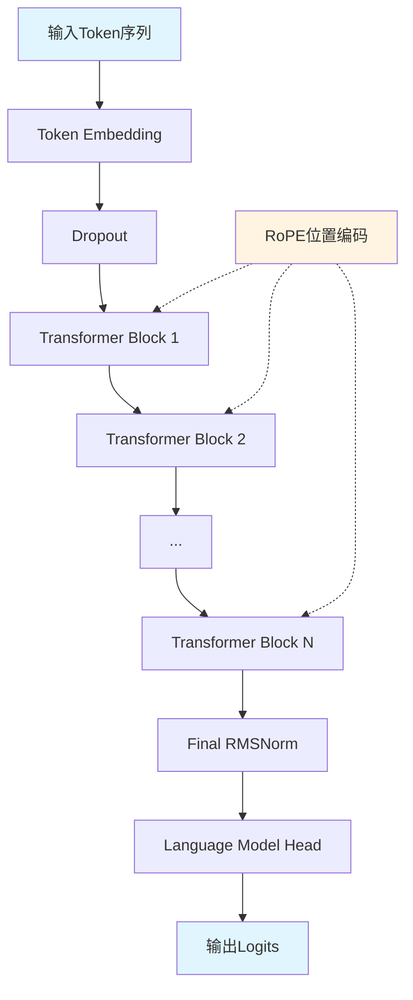
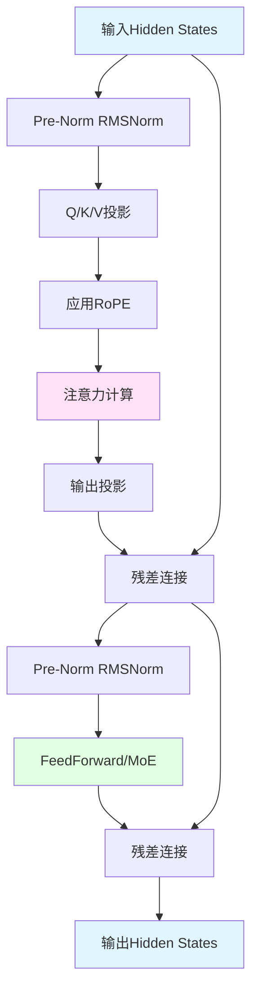
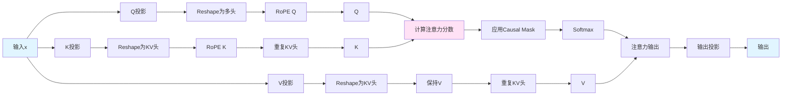
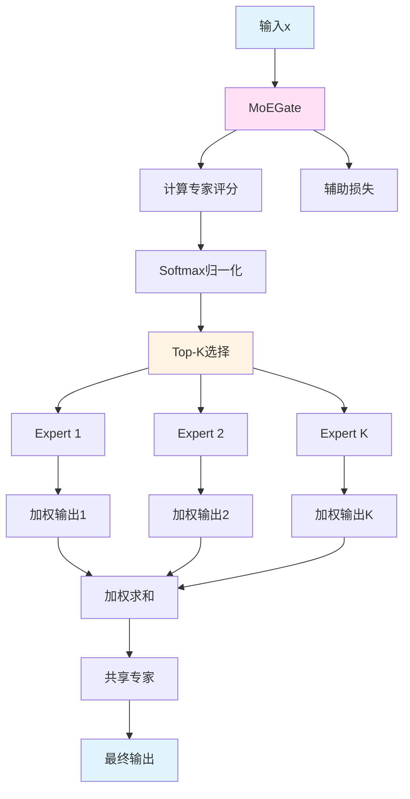
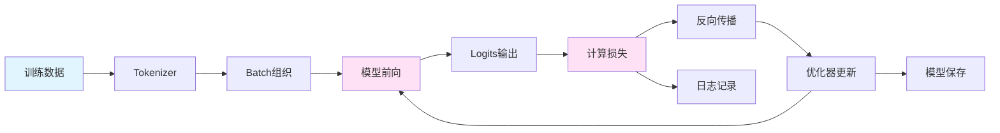
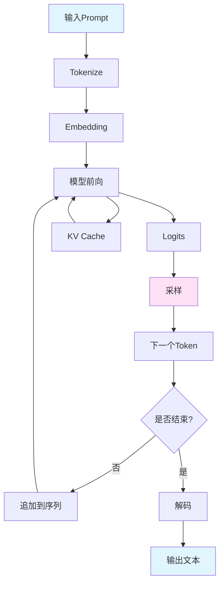

# MiniMind模型架构详细指南

> 本文档全面解析MiniMind模型的架构设计、数学原理、代码实现和使用方法

## 目录

- [1. 引言](#1-引言)
  - [1.1 MiniMind模型简介](#11-minimind模型简介)
  - [1.2 与主流模型的对比](#12-与主流模型的对比)
  - [1.3 模型规格对照表](#13-模型规格对照表)
  - [1.4 整体架构概览](#14-整体架构概览)
- [2. 核心组件详解](#2-核心组件详解)
  - [2.1 配置类 (MiniMindConfig)](#21-配置类-minimindconfig)
  - [2.2 RMSNorm归一化](#22-rmsnorm归一化)
  - [2.3 旋转位置编码 (RoPE)](#23-旋转位置编码-rope)
  - [2.4 注意力机制 (Attention)](#24-注意力机制-attention)
  - [2.5 前馈网络 (FeedForward)](#25-前馈网络-feedforward)
  - [2.6 MoE架构](#26-moe架构)
- [3. 完整模型组装](#3-完整模型组装)
  - [3.1 MiniMindBlock](#31-minimindblock)
  - [3.2 MiniMindModel](#32-minimindmodel)
  - [3.3 MiniMindForCausalLM](#33-minimindforcausallm)
- [4. 训练流程详解](#4-训练流程详解)
- [5. 推理流程详解](#5-推理流程详解)
- [6. Mermaid架构图](#6-mermaid架构图)
- [7. 实战示例](#7-实战示例)
- [8. 性能优化与技巧](#8-性能优化与技巧)
- [9. 常见问题解答](#9-常见问题解答)

---

## 1. 引言

### 1.1 MiniMind模型简介

MiniMind是一个极简的超小型语言模型（Ultra-Small Language Model），旨在以最低的成本和门槛实现从零训练一个具备基本对话能力的语言模型。MiniMind系列模型参数量从25.8M到145M不等，是GPT-3参数量（175B）的1/7000到1/1200。

**核心设计理念：**
- **大道至简**：采用最经典的Transformer Decoder架构，去除不必要的复杂性
- **极低成本**：单卡3090仅需2小时+3元即可训练出可用的对话模型
- **完全开源**：从数据预处理到训练、推理的全流程代码完全开源
- **易于理解**：代码结构清晰，注释详细，适合学习和研究

**技术特点：**
- 采用RMSNorm归一化（相比LayerNorm更高效）
- 使用RoPE旋转位置编码（支持YaRN长文本外推）
- 实现GQA分组查询注意力（减少KV缓存显存占用）
- 支持MoE混合专家架构（可选）
- 兼容Flash Attention加速

### 1.2 与主流模型的对比

MiniMind在架构设计上参考了LLaMA、GPT-3等主流模型，但在实现上做了针对性的简化：

| 特性 | GPT-3 | LLaMA | MiniMind |
|------|-------|-------|----------|
| 归一化 | LayerNorm | RMSNorm | RMSNorm |
| 位置编码 | 绝对位置编码 | RoPE | RoPE + YaRN |
| 激活函数 | ReLU | SwiGLU | SwiGLU |
| 注意力 | 标准多头注意力 | GQA | GQA |
| MoE支持 | 否 | 是（部分版本） | 是（可选） |
| 预标准化 | 否 | 是 | 是 |

**与LLaMA的主要区别：**
1. **参数量级**：MiniMind专注于超小模型（<150M），而LLaMA最小版本也有7B
2. **词表大小**：MiniMind使用自定义tokenizer，词表仅6400，远小于LLaMA的128K
3. **训练数据**：MiniMind使用精简的高质量数据集，训练时间大幅缩短
4. **代码实现**：MiniMind代码更简洁，便于理解和修改

### 1.3 模型规格对照表

| Model Name | params | len_vocab | rope_theta | n_layers | d_model | kv_heads | q_heads | share+route |
|------------|--------|-----------|------------|----------|---------|----------|---------|-------------|
| MiniMind2-Small | 26M | 6400 | 1e6 | 8 | 512 | 2 | 8 | - |
| MiniMind2-MoE | 145M | 6400 | 1e6 | 8 | 640 | 2 | 8 | 1+4 |
| MiniMind2 | 104M | 6400 | 1e6 | 16 | 768 | 2 | 8 | - |

**参数说明：**
- `params`: 模型总参数量
- `len_vocab`: 词表大小
- `rope_theta`: RoPE位置编码的基础频率
- `n_layers`: Transformer层数
- `d_model`: 隐藏层维度（hidden_size）
- `kv_heads`: Key-Value注意力头数
- `q_heads`: Query注意力头数
- `share+route`: 共享专家数+路由专家数（MoE架构）

### 1.4 整体架构概览

MiniMind采用标准的Transformer Decoder架构，整体结构如下：

```
输入Token序列
    ↓
Token Embedding (词嵌入层)
    ↓
Dropout
    ↓
┌─────────────────────────────────────┐
│  Transformer Block × N (N=8或16)    │
│  ┌───────────────────────────────┐  │
│  │ Pre-Norm (RMSNorm)            │  │
│  │ ↓                             │  │
│  │ Multi-Head Attention (GQA)    │  │
│  │ ↓                             │  │
│  │ Residual Connection           │  │
│  │ ↓                             │  │
│  │ Pre-Norm (RMSNorm)            │  │
│  │ ↓                             │  │
│  │ FeedForward / MoE-FFN         │  │
│  │ ↓                             │  │
│  │ Residual Connection           │  │
│  └───────────────────────────────┘  │
└─────────────────────────────────────┘
    ↓
Final Norm (RMSNorm)
    ↓
Language Model Head (线性层)
    ↓
输出Logits (词汇表概率分布)
```

**关键设计：**
- **Pre-Norm架构**：在每个子层（Attention、FFN）之前进行归一化，训练更稳定
- **残差连接**：每个子层都有残差连接，保证梯度流动
- **RoPE位置编码**：在Attention层中动态应用，无需额外的位置嵌入层
- **权重共享**：Embedding层和LM Head共享权重，减少参数量

---

## 2. 核心组件详解

### 2.1 配置类 (MiniMindConfig)

配置类定义了模型的所有超参数，位于 [`model/model_minimind.py`](model/model_minimind.py) 的第8-79行。

#### 2.1.1 基础参数

```python
class MiniMindConfig(PretrainedConfig):
    def __init__(
        self,
        dropout: float = 0.0,                    # Dropout比率
        hidden_size: int = 512,                 # 隐藏层维度
        num_hidden_layers: int = 8,             # Transformer层数
        num_attention_heads: int = 8,            # Query注意力头数
        num_key_value_heads: int = 2,           # KV注意力头数（GQA）
        vocab_size: int = 6400,                 # 词表大小
        max_position_embeddings: int = 32768,    # 最大位置编码长度
        intermediate_size: int = None,          # FFN中间层维度（自动计算）
        hidden_act: str = 'silu',              # 激活函数（SwiGLU）
        rms_norm_eps: float = 1e-05,           # RMSNorm的epsilon
        rope_theta: int = 1000000.0,           # RoPE基础频率
        flash_attn: bool = True,                # 是否使用Flash Attention
        ...
    )
```

#### 2.1.2 MoE配置参数

当 `use_moe=True` 时，以下参数生效：

```python
use_moe: bool = False,              # 是否启用MoE架构
num_experts_per_tok: int = 2,      # 每个token选择的专家数量（Top-K）
n_routed_experts: int = 4,          # 路由专家总数
n_shared_experts: int = 1,          # 共享专家数量
scoring_func: str = 'softmax',      # 专家评分函数
aux_loss_alpha: float = 0.01,      # 负载均衡损失的权重
seq_aux: bool = True,               # 是否在序列级别计算辅助损失
norm_topk_prob: bool = True,       # 是否标准化Top-K概率
```

#### 2.1.3 RoPE缩放配置

MiniMind支持YaRN（Yet another RoPE extensioN）算法进行长文本外推：

```python
inference_rope_scaling: bool = False  # 是否启用RoPE外推

# 当inference_rope_scaling=True时，自动配置：
self.rope_scaling = {
    "beta_fast": 32,                          # 快速beta参数
    "beta_slow": 1,                           # 慢速beta参数
    "factor": 16,                             # 外推倍数
    "original_max_position_embeddings": 2048, # 原始训练长度
    "attention_factor": 1.0,                   # 注意力因子
    "type": "yarn"                            # 缩放类型
}
```

**YaRN原理简述：**
YaRN通过线性插值的方式调整RoPE的频率，使得模型能够处理超出训练长度的文本。公式为：

$$f'(i) = f(i) \cdot \left((1-\gamma) + \frac{\gamma}{s}\right)$$

其中：
- $f(i)$ 是原始频率
- $\gamma$ 是线性ramp系数（根据频率维度计算）
- $s$ 是缩放因子（factor）

### 2.2 RMSNorm归一化

RMSNorm（Root Mean Square Layer Normalization）是一种简化的归一化方法，相比LayerNorm去除了均值中心化，计算更高效。

#### 2.2.1 数学原理

RMSNorm的数学公式为：

$$\text{RMSNorm}(x) = \frac{x}{\sqrt{\frac{1}{d}\sum_{i=1}^d x_i^2 + \epsilon}} \cdot \gamma$$

其中：
- $x \in \mathbb{R}^d$ 是输入向量
- $d$ 是特征维度
- $\epsilon$ 是防止除零的小常数（默认1e-5）
- $\gamma \in \mathbb{R}^d$ 是可学习的缩放参数

**与LayerNorm的对比：**

LayerNorm公式：
$$\text{LayerNorm}(x) = \frac{x - \mu}{\sqrt{\sigma^2 + \epsilon}} \cdot \gamma + \beta$$

其中 $\mu = \frac{1}{d}\sum_{i=1}^d x_i$，$\sigma^2 = \frac{1}{d}\sum_{i=1}^d (x_i - \mu)^2$

**RMSNorm的优势：**
1. **计算更简单**：不需要计算均值，减少了计算量
2. **数值稳定**：避免了均值减法的数值误差
3. **效果相当**：在大多数情况下性能与LayerNorm相当

#### 2.2.2 代码实现

RMSNorm的实现位于 [`model/model_minimind.py`](model/model_minimind.py) 的第96-106行：

```python
class RMSNorm(torch.nn.Module):
    def __init__(self, dim: int, eps: float = 1e-5):
        super().__init__()
        self.eps = eps
        self.weight = nn.Parameter(torch.ones(dim))  # 可学习的缩放参数γ

    def _norm(self, x):
        # 计算RMS: sqrt(mean(x^2) + eps)
        return x * torch.rsqrt(x.pow(2).mean(-1, keepdim=True) + self.eps)

    def forward(self, x):
        # 先归一化，再乘以可学习权重
        return self.weight * self._norm(x.float()).type_as(x)
```

**实现细节：**
- 使用 `torch.rsqrt()` 计算 $1/\sqrt{\cdot}$，比先开方再倒数更高效
- `keepdim=True` 保持维度，便于广播
- `.float()` 确保数值精度，最后 `.type_as(x)` 恢复原始数据类型

### 2.3 旋转位置编码 (RoPE)

RoPE（Rotary Position Embedding）是一种相对位置编码方法，通过旋转矩阵将位置信息编码到注意力计算中。

#### 2.3.1 数学原理

RoPE的核心思想是将位置信息编码为旋转矩阵。对于位置 $m$ 和维度 $i$，旋转角度为：

$$\theta_i = \frac{1}{10000^{2i/d}}$$

其中 $d$ 是注意力头的维度。

对于位置 $m$ 的查询向量 $q$ 和键向量 $k$，旋转后的向量为：

$$\begin{aligned}
\tilde{q}_m &= q_m \odot e^{im\theta} \\
\tilde{k}_n &= k_n \odot e^{in\theta}
\end{aligned}$$

其中 $\odot$ 表示逐元素相乘，$e^{im\theta}$ 是复数旋转。

在实际实现中，将复数旋转分解为实数矩阵形式：

$$\begin{bmatrix}
q^{(0)}_m \\
q^{(1)}_m
\end{bmatrix} = \begin{bmatrix}
\cos m\theta & -\sin m\theta \\
\sin m\theta & \cos m\theta
\end{bmatrix} \begin{bmatrix}
q^{(0)} \\
q^{(1)}
\end{bmatrix}$$

#### 2.3.2 频率预计算

`precompute_freqs_cis` 函数预计算所有位置的旋转频率，位于第109-128行：

```python
def precompute_freqs_cis(dim: int, end: int = int(32 * 1024), 
                        rope_base: float = 1e6,
                        rope_scaling: Optional[dict] = None):
    # 计算基础频率: 1 / (rope_base^(2i/dim))
    freqs = 1.0 / (rope_base ** (torch.arange(0, dim, 2)[: (dim // 2)].float() / dim))
    attn_factor = 1.0
    
    # YaRN缩放（如果启用）
    if rope_scaling is not None:
        orig_max = rope_scaling.get("original_max_position_embeddings", 2048)
        factor = rope_scaling.get("factor", 16)
        beta_fast = rope_scaling.get("beta_fast", 32.0)
        beta_slow = rope_scaling.get("beta_slow", 1.0)
        
        if end / orig_max > 1.0:
            # 计算需要调整的频率范围
            inv_dim = lambda b: (dim * math.log(orig_max / (b * 2 * math.pi))) / (2 * math.log(rope_base))
            low = max(math.floor(inv_dim(beta_fast)), 0)
            high = min(math.ceil(inv_dim(beta_slow)), dim // 2 - 1)
            
            # 线性ramp: γ从0到1
            ramp = torch.clamp((torch.arange(dim // 2, device=freqs.device).float() - low) / 
                               max(high - low, 0.001), 0, 1)
            # 应用缩放: f'(i) = f(i) * ((1-γ) + γ/s)
            freqs = freqs * (1 - ramp + ramp / factor)
    
    # 计算所有位置的频率矩阵
    t = torch.arange(end, device=freqs.device)
    freqs = torch.outer(t, freqs).float()
    
    # 生成cos和sin值（重复一次以匹配完整维度）
    freqs_cos = torch.cat([torch.cos(freqs), torch.cos(freqs)], dim=-1) * attn_factor
    freqs_sin = torch.cat([torch.sin(freqs), torch.sin(freqs)], dim=-1) * attn_factor
    
    return freqs_cos, freqs_sin
```

**关键步骤：**
1. 计算基础频率：$\theta_i = 1 / \text{rope_base}^{2i/d}$
2. YaRN调整：对超出训练长度的频率进行缩放
3. 生成cos/sin矩阵：预计算所有位置的旋转值

#### 2.3.3 位置编码应用

`apply_rotary_pos_emb` 函数将RoPE应用到Q和K向量，位于第131-137行：

```python
def apply_rotary_pos_emb(q, k, cos, sin, position_ids=None, unsqueeze_dim=1):
    def rotate_half(x):
        # 将后一半维度取负并与前一半拼接: [-x[d/2:], x[:d/2]]
        return torch.cat((-x[..., x.shape[-1] // 2:], x[..., : x.shape[-1] // 2]), dim=-1)

    # 旋转公式: q' = q*cos + rotate_half(q)*sin
    q_embed = (q * cos.unsqueeze(unsqueeze_dim)) + (rotate_half(q) * sin.unsqueeze(unsqueeze_dim))
    k_embed = (k * cos.unsqueeze(unsqueeze_dim)) + (rotate_half(k) * sin.unsqueeze(unsqueeze_dim))
    return q_embed, k_embed
```

**旋转实现：**
- `rotate_half` 实现了复数旋转的实数形式：$(a+bi) \cdot e^{i\theta} = (a+bi)(\cos\theta + i\sin\theta)$
- 展开后：实部 = $a\cos\theta - b\sin\theta$，虚部 = $a\sin\theta + b\cos\theta$
- 代码中通过 `[-x[d/2:], x[:d/2]]` 实现了这个变换

### 2.4 注意力机制 (Attention)

MiniMind实现了GQA（Grouped Query Attention），这是一种介于标准多头注意力和MQA之间的折中方案。

#### 2.4.1 GQA原理

**标准多头注意力（MHA）：**
- Q、K、V都有 $H$ 个头
- 参数量：$3Hd_{head}$

**多查询注意力（MQA）：**
- Q有 $H$ 个头，K、V只有1个头
- 参数量：$(H+2)d_{head}$
- 问题：表达能力受限

**分组查询注意力（GQA）：**
- Q有 $H$ 个头，K、V有 $G$ 个头（$G < H$）
- 参数量：$(H+2G)d_{head}$
- 优势：在参数量和表达能力之间取得平衡

**MiniMind的GQA配置：**
- Query头数：8（`num_attention_heads`）
- KV头数：2（`num_key_value_heads`）
- 重复倍数：$n_{rep} = 8/2 = 4$（每个KV头被4个Q头共享）

#### 2.4.2 KV重复机制

`repeat_kv` 函数将KV头重复以匹配Q头数量，位于第140-147行：

```python
def repeat_kv(x: torch.Tensor, n_rep: int) -> torch.Tensor:
    """将KV头重复n_rep次以匹配Q头数量"""
    bs, slen, num_key_value_heads, head_dim = x.shape
    if n_rep == 1:
        return x
    return (
        x[:, :, :, None, :].expand(bs, slen, num_key_value_heads, n_rep, head_dim)
        .reshape(bs, slen, num_key_value_heads * n_rep, head_dim)
    )
```

**实现技巧：**
- 使用 `expand` 进行零拷贝的维度扩展
- 通过 `reshape` 将重复的KV头展平

#### 2.4.3 Attention实现

Attention类的完整实现在第150-216行：

```python
class Attention(nn.Module):
    def __init__(self, args: MiniMindConfig):
        super().__init__()
        self.num_key_value_heads = args.num_key_value_heads or args.num_attention_heads
        self.n_local_heads = args.num_attention_heads
        self.n_local_kv_heads = self.num_key_value_heads
        self.n_rep = self.n_local_heads // self.n_local_kv_heads  # 重复倍数
        self.head_dim = args.hidden_size // args.num_attention_heads
        
        # 线性投影层
        self.q_proj = nn.Linear(args.hidden_size, args.num_attention_heads * self.head_dim, bias=False)
        self.k_proj = nn.Linear(args.hidden_size, self.num_key_value_heads * self.head_dim, bias=False)
        self.v_proj = nn.Linear(args.hidden_size, self.num_key_value_heads * self.head_dim, bias=False)
        self.o_proj = nn.Linear(args.num_attention_heads * self.head_dim, args.hidden_size, bias=False)
        
        self.attn_dropout = nn.Dropout(args.dropout)
        self.resid_dropout = nn.Dropout(args.dropout)
        self.dropout = args.dropout
        
        # Flash Attention支持
        self.flash = hasattr(torch.nn.functional, 'scaled_dot_product_attention') and args.flash_attn

    def forward(self, x, position_embeddings, past_key_value=None, 
                use_cache=False, attention_mask=None):
        bsz, seq_len, _ = x.shape
        
        # 1. 线性投影
        xq, xk, xv = self.q_proj(x), self.k_proj(x), self.v_proj(x)
        xq = xq.view(bsz, seq_len, self.n_local_heads, self.head_dim)
        xk = xk.view(bsz, seq_len, self.n_local_kv_heads, self.head_dim)
        xv = xv.view(bsz, seq_len, self.n_local_kv_heads, self.head_dim)
        
        # 2. 应用RoPE位置编码
        cos, sin = position_embeddings
        xq, xk = apply_rotary_pos_emb(xq, xk, cos[:seq_len], sin[:seq_len])
        
        # 3. KV Cache（推理时使用）
        if past_key_value is not None:
            xk = torch.cat([past_key_value[0], xk], dim=1)
            xv = torch.cat([past_key_value[1], xv], dim=1)
        past_kv = (xk, xv) if use_cache else None
        
        # 4. 重复KV头以匹配Q头
        xq, xk, xv = (
            xq.transpose(1, 2),  # [bsz, n_heads, seq_len, head_dim]
            repeat_kv(xk, self.n_rep).transpose(1, 2),
            repeat_kv(xv, self.n_rep).transpose(1, 2)
        )
        
        # 5. 计算注意力
        if self.flash and seq_len > 1 and (attention_mask is None or torch.all(attention_mask == 1)):
            # Flash Attention（PyTorch 2.0+）
            output = F.scaled_dot_product_attention(
                xq, xk, xv, 
                dropout_p=self.dropout if self.training else 0.0, 
                is_causal=True
            )
        else:
            # 标准注意力计算
            scores = (xq @ xk.transpose(-2, -1)) / math.sqrt(self.head_dim)
            
            # Causal mask（下三角掩码）
            scores = scores + torch.triu(
                torch.full((seq_len, seq_len), float("-inf"), device=scores.device),
                diagonal=1
            ).unsqueeze(0).unsqueeze(0)
            
            # 额外的attention_mask（如果有）
            if attention_mask is not None:
                extended_attention_mask = attention_mask.unsqueeze(1).unsqueeze(2)
                extended_attention_mask = (1.0 - extended_attention_mask) * -1e9
                scores = scores + extended_attention_mask
            
            scores = F.softmax(scores.float(), dim=-1).type_as(xq)
            scores = self.attn_dropout(scores)
            output = scores @ xv
        
        # 6. 输出投影
        output = output.transpose(1, 2).reshape(bsz, seq_len, -1)
        output = self.resid_dropout(self.o_proj(output))
        return output, past_kv
```

**关键步骤解析：**

1. **线性投影**：将输入 $x$ 投影为Q、K、V
2. **RoPE应用**：对Q和K应用旋转位置编码
3. **KV Cache**：推理时缓存历史KV，避免重复计算
4. **KV重复**：将KV头重复以匹配Q头数量
5. **注意力计算**：
   - Flash Attention：使用PyTorch优化实现（更快）
   - 标准实现：手动计算注意力分数和softmax
6. **输出投影**：将多头输出合并并投影回原始维度

**注意力公式：**

$$\text{Attention}(Q, K, V) = \text{softmax}\left(\frac{QK^T}{\sqrt{d_k}} + M\right)V$$

其中：
- $M$ 是causal mask（下三角为0，上三角为$-\infty$）
- $\sqrt{d_k}$ 是缩放因子，防止softmax饱和

### 2.5 前馈网络 (FeedForward)

MiniMind使用SwiGLU激活函数的前馈网络，这是LLaMA等现代模型的标准配置。

#### 2.5.1 SwiGLU激活函数

SwiGLU（Swish-Gated Linear Unit）结合了Swish激活和门控机制：

$$\text{SwiGLU}(x) = \text{SiLU}(xW_g) \odot (xW_u)$$

其中：
- $\text{SiLU}(x) = x \cdot \sigma(x) = x \cdot \frac{1}{1+e^{-x}}$（Swish激活）
- $\odot$ 是逐元素相乘（Hadamard积）
- $W_g$ 是门控投影矩阵
- $W_u$ 是上投影矩阵

**完整FFN公式：**

$$\text{FFN}(x) = \text{Dropout}(\text{SwiGLU}(xW_g) \odot (xW_u) W_d)$$

#### 2.5.2 中间层维度计算

MiniMind的FFN中间层维度遵循LLaMA的设计：

```python
if config.intermediate_size is None:
    intermediate_size = int(config.hidden_size * 8 / 3)
    # 向上取整到64的倍数（对齐优化）
    config.intermediate_size = 64 * ((intermediate_size + 64 - 1) // 64)
```

**示例：**
- `hidden_size=512` → `intermediate_size = 64 * ((512*8/3 + 64 - 1) // 64) = 64 * 22 = 1408`
- `hidden_size=768` → `intermediate_size = 64 * ((768*8/3 + 64 - 1) // 64) = 64 * 33 = 2112`

#### 2.5.3 FeedForward实现

FeedForward类的实现在第219-232行：

```python
class FeedForward(nn.Module):
    def __init__(self, config: MiniMindConfig):
        super().__init__()
        if config.intermediate_size is None:
            intermediate_size = int(config.hidden_size * 8 / 3)
            config.intermediate_size = 64 * ((intermediate_size + 64 - 1) // 64)
        
        self.gate_proj = nn.Linear(config.hidden_size, config.intermediate_size, bias=False)
        self.down_proj = nn.Linear(config.intermediate_size, config.hidden_size, bias=False)
        self.up_proj = nn.Linear(config.hidden_size, config.intermediate_size, bias=False)
        self.dropout = nn.Dropout(config.dropout)
        self.act_fn = ACT2FN[config.hidden_act]  # SiLU激活函数

    def forward(self, x):
        # SwiGLU: SiLU(gate) * up
        gate = self.act_fn(self.gate_proj(x))  # SiLU(xW_g)
        up = self.up_proj(x)                   # xW_u
        return self.dropout(self.down_proj(gate * up))  # Dropout((gate * up)W_d)
```

**计算流程：**
1. `gate_proj`: $x \rightarrow xW_g$（门控投影）
2. `act_fn`: $\text{SiLU}(xW_g)$（Swish激活）
3. `up_proj`: $x \rightarrow xW_u$（上投影）
4. 逐元素相乘：$\text{SiLU}(xW_g) \odot (xW_u)$
5. `down_proj`: 投影回原始维度并应用Dropout

### 2.6 MoE架构

MoE（Mixture of Experts）是一种条件计算架构，通过专家路由机制实现模型容量的动态扩展。

#### 2.6.1 MoE核心思想

MoE将前馈网络替换为多个专家（Expert），每个token根据门控网络（Gate）的评分选择Top-K个专家：

$$\text{MoE}(x) = \sum_{i \in \text{TopK}} w_i \cdot \text{Expert}_i(x)$$

其中：
- $w_i$ 是专家 $i$ 的权重（由Gate网络计算）
- $\text{TopK}$ 是评分最高的K个专家索引

#### 2.6.2 MoEGate实现

MoEGate类负责专家路由，位于第235-288行：

```python
class MoEGate(nn.Module):
    def __init__(self, config: MiniMindConfig):
        super().__init__()
        self.config = config
        self.top_k = config.num_experts_per_tok  # Top-K专家数
        self.n_routed_experts = config.n_routed_experts  # 路由专家总数
        
        self.scoring_func = config.scoring_func  # 评分函数（softmax）
        self.alpha = config.aux_loss_alpha      # 负载均衡损失权重
        self.seq_aux = config.seq_aux           # 序列级辅助损失
        
        self.norm_topk_prob = config.norm_topk_prob  # 是否标准化Top-K概率
        self.gating_dim = config.hidden_size
        self.weight = nn.Parameter(torch.empty((self.n_routed_experts, self.gating_dim)))
        self.reset_parameters()

    def reset_parameters(self) -> None:
        # Kaiming初始化
        init.kaiming_uniform_(self.weight, a=math.sqrt(5))

    def forward(self, hidden_states):
        bsz, seq_len, h = hidden_states.shape
        hidden_states = hidden_states.view(-1, h)  # [B*L, H]
        
        # 计算专家评分
        logits = F.linear(hidden_states, self.weight, None)  # [B*L, n_experts]
        scores = logits.softmax(dim=-1)  # Softmax归一化
        
        # Top-K选择
        topk_weight, topk_idx = torch.topk(scores, k=self.top_k, dim=-1, sorted=False)
        
        # 标准化Top-K权重（可选）
        if self.top_k > 1 and self.norm_topk_prob:
            denominator = topk_weight.sum(dim=-1, keepdim=True) + 1e-20
            topk_weight = topk_weight / denominator
        
        # 计算负载均衡损失（训练时）
        if self.training and self.alpha > 0.0:
            aux_loss = self._compute_aux_loss(scores, topk_idx, bsz, seq_len)
        else:
            aux_loss = 0
        
        return topk_idx, topk_weight, aux_loss
```

**负载均衡损失：**

MoE需要确保所有专家都被均匀使用，避免某些专家被忽略。辅助损失的计算在第269-287行：

```python
if self.training and self.alpha > 0.0:
    scores_for_aux = scores
    aux_topk = self.top_k
    topk_idx_for_aux_loss = topk_idx.view(bsz, -1)
    
    if self.seq_aux:
        # 序列级辅助损失
        scores_for_seq_aux = scores_for_aux.view(bsz, seq_len, -1)
        ce = torch.zeros(bsz, self.n_routed_experts, device=hidden_states.device)
        ce.scatter_add_(1, topk_idx_for_aux_loss,
                        torch.ones(bsz, seq_len * aux_topk, device=hidden_states.device))
        ce.div_(seq_len * aux_topk / self.n_routed_experts)
        aux_loss = (ce * scores_for_seq_aux.mean(dim=1)).sum(dim=1).mean() * self.alpha
    else:
        # Token级辅助损失
        mask_ce = F.one_hot(topk_idx_for_aux_loss.view(-1), num_classes=self.n_routed_experts)
        ce = mask_ce.float().mean(0)
        Pi = scores_for_aux.mean(0)
        fi = ce * self.n_routed_experts
        aux_loss = (Pi * fi).sum() * self.alpha
```

**辅助损失的作用：**
- 鼓励专家负载均衡：$L_{aux} = \alpha \cdot \sum_i P_i \cdot f_i$
- 其中 $P_i$ 是专家 $i$ 的平均评分，$f_i$ 是专家 $i$ 的使用频率
- 理想情况下，所有专家被均匀使用，$f_i = 1/n$

#### 2.6.3 MOEFeedForward实现

MOEFeedForward类整合了多个专家和门控网络，位于第291-350行：

```python
class MOEFeedForward(nn.Module):
    def __init__(self, config: MiniMindConfig):
        super().__init__()
        self.config = config
        # 路由专家列表
        self.experts = nn.ModuleList([
            FeedForward(config) for _ in range(config.n_routed_experts)
        ])
        self.gate = MoEGate(config)
        
        # 共享专家（可选）
        if config.n_shared_experts > 0:
            self.shared_experts = nn.ModuleList([
                FeedForward(config) for _ in range(config.n_shared_experts)
            ])

    def forward(self, x):
        identity = x
        orig_shape = x.shape
        bsz, seq_len, _ = x.shape
        
        # 1. 门控网络选择专家
        topk_idx, topk_weight, aux_loss = self.gate(x)
        x = x.view(-1, x.shape[-1])  # [B*L, H]
        flat_topk_idx = topk_idx.view(-1)  # [B*L*K]
        
        if self.training:
            # 训练模式：为每个token的每个专家计算输出
            x = x.repeat_interleave(self.config.num_experts_per_tok, dim=0)  # [B*L*K, H]
            y = torch.empty_like(x, dtype=x.dtype)
            
            # 为每个专家计算输出
            for i, expert in enumerate(self.experts):
                y[flat_topk_idx == i] = expert(x[flat_topk_idx == i]).to(y.dtype)
            
            # 加权求和
            y = (y.view(*topk_weight.shape, -1) * topk_weight.unsqueeze(-1)).sum(dim=1)
            y = y.view(*orig_shape)
        else:
            # 推理模式：优化的批处理计算
            y = self.moe_infer(x, flat_topk_idx, topk_weight.view(-1, 1)).view(*orig_shape)
        
        # 2. 添加共享专家输出（如果有）
        if self.config.n_shared_experts > 0:
            for expert in self.shared_experts:
                y = y + expert(identity)
        
        self.aux_loss = aux_loss
        return y
```

**训练vs推理模式：**

- **训练模式**：为每个token的每个Top-K专家都计算输出，然后加权求和
- **推理模式**：使用 `moe_infer` 函数进行优化，按专家分组批处理

**推理优化实现：**

`moe_infer` 函数（第329-350行）通过专家分组实现高效推理：

```python
@torch.no_grad()
def moe_infer(self, x, flat_expert_indices, flat_expert_weights):
    expert_cache = torch.zeros_like(x)
    idxs = flat_expert_indices.argsort()  # 按专家索引排序
    tokens_per_expert = flat_expert_indices.bincount().cpu().numpy().cumsum(0)
    token_idxs = idxs // self.config.num_experts_per_tok
    
    # 为每个专家批量处理其负责的tokens
    for i, end_idx in enumerate(tokens_per_expert):
        start_idx = 0 if i == 0 else tokens_per_expert[i - 1]
        if start_idx == end_idx:
            continue
        
        expert = self.experts[i]
        exp_token_idx = token_idxs[start_idx:end_idx]
        expert_tokens = x[exp_token_idx]
        expert_out = expert(expert_tokens).to(expert_cache.dtype)
        expert_out.mul_(flat_expert_weights[idxs[start_idx:end_idx]])
        expert_cache.scatter_add_(0, exp_token_idx.view(-1, 1).repeat(1, x.shape[-1]), expert_out)
    
    return expert_cache
```

**优化技巧：**
1. 按专家索引排序，将同一专家的tokens聚集在一起
2. 批量处理每个专家的所有tokens，提高GPU利用率
3. 使用 `scatter_add_` 累加多个专家对同一token的贡献

---

## 3. 完整模型组装

### 3.1 MiniMindBlock

MiniMindBlock是Transformer的核心单元，包含一个Attention层和一个FFN/MoE层。

#### 3.1.1 Pre-Norm架构

MiniMind采用Pre-Norm架构，即在每个子层之前进行归一化：

```python
class MiniMindBlock(nn.Module):
    def __init__(self, layer_id: int, config: MiniMindConfig):
        super().__init__()
        self.self_attn = Attention(config)
        self.input_layernorm = RMSNorm(config.hidden_size, eps=config.rms_norm_eps)
        self.post_attention_layernorm = RMSNorm(config.hidden_size, eps=config.rms_norm_eps)
        # 根据配置选择FFN或MoE
        self.mlp = FeedForward(config) if not config.use_moe else MOEFeedForward(config)

    def forward(self, hidden_states, position_embeddings, 
                past_key_value=None, use_cache=False, attention_mask=None):
        residual = hidden_states
        
        # Pre-Norm + Attention + Residual
        hidden_states, present_key_value = self.self_attn(
            self.input_layernorm(hidden_states),  # Pre-Norm
            position_embeddings,
            past_key_value, use_cache, attention_mask
        )
        hidden_states += residual  # Residual Connection
        
        # Pre-Norm + FFN/MoE + Residual
        hidden_states = hidden_states + self.mlp(
            self.post_attention_layernorm(hidden_states)  # Pre-Norm
        )
        
        return hidden_states, present_key_value
```

**Pre-Norm vs Post-Norm：**

- **Pre-Norm**：`x → Norm → SubLayer → +x`
  - 优势：训练更稳定，梯度流动更好
  - 劣势：需要更深的网络才能达到相同效果

- **Post-Norm**：`x → SubLayer → Norm → +x`
  - 优势：理论上表达能力更强
  - 劣势：训练不稳定，需要warmup

#### 3.1.2 残差连接

每个子层都有残差连接，保证梯度能够直接回传到输入：

$$y = x + \text{SubLayer}(\text{Norm}(x))$$

这确保了即使子层的梯度很小，输入也能接收到梯度信号。

### 3.2 MiniMindModel

MiniMindModel是完整的Transformer模型，包含Embedding层、多层Block和最终归一化。

#### 3.2.1 模型初始化

```python
class MiniMindModel(nn.Module):
    def __init__(self, config: MiniMindConfig):
        super().__init__()
        self.config = config
        self.vocab_size = config.vocab_size
        self.num_hidden_layers = config.num_hidden_layers
        
        # Token Embedding
        self.embed_tokens = nn.Embedding(config.vocab_size, config.hidden_size)
        self.dropout = nn.Dropout(config.dropout)
        
        # Transformer Blocks
        self.layers = nn.ModuleList([
            MiniMindBlock(l, config) for l in range(self.num_hidden_layers)
        ])
        
        # Final Norm
        self.norm = RMSNorm(config.hidden_size, eps=config.rms_norm_eps)
        
        # 预计算RoPE位置编码
        freqs_cos, freqs_sin = precompute_freqs_cis(
            dim=config.hidden_size // config.num_attention_heads,
            end=config.max_position_embeddings,
            rope_base=config.rope_theta,
            rope_scaling=config.rope_scaling
        )
        self.register_buffer("freqs_cos", freqs_cos, persistent=False)
        self.register_buffer("freqs_sin", freqs_sin, persistent=False)
```

**关键设计：**
1. **位置编码预计算**：RoPE的cos/sin值在初始化时预计算，避免每次前向传播重复计算
2. **persistent=False**：不将位置编码保存到checkpoint，节省存储空间
3. **ModuleList**：使用ModuleList而非普通list，确保所有层都被注册为子模块

#### 3.2.2 前向传播

```python
def forward(self, input_ids, attention_mask=None, 
            past_key_values=None, use_cache=False, **kwargs):
    batch_size, seq_length = input_ids.shape
    
    # 处理past_key_values
    if hasattr(past_key_values, 'layers'):
        past_key_values = None
    past_key_values = past_key_values or [None] * len(self.layers)
    
    # 计算当前序列的起始位置（用于KV Cache）
    start_pos = past_key_values[0][0].shape[1] if past_key_values[0] is not None else 0
    
    # Token Embedding
    hidden_states = self.dropout(self.embed_tokens(input_ids))
    
    # 获取当前位置的RoPE编码
    position_embeddings = (
        self.freqs_cos[start_pos:start_pos + seq_length],
        self.freqs_sin[start_pos:start_pos + seq_length]
    )
    
    # 逐层处理
    presents = []
    for layer_idx, (layer, past_key_value) in enumerate(zip(self.layers, past_key_values)):
        hidden_states, present = layer(
            hidden_states,
            position_embeddings,
            past_key_value=past_key_value,
            use_cache=use_cache,
            attention_mask=attention_mask
        )
        presents.append(present)
    
    # Final Norm
    hidden_states = self.norm(hidden_states)
    
    # 聚合MoE辅助损失
    aux_loss = sum(
        layer.mlp.aux_loss
        for layer in self.layers
        if isinstance(layer.mlp, MOEFeedForward)
    )
    
    return hidden_states, presents, aux_loss
```

**KV Cache机制：**
- `start_pos`：当前序列在历史中的起始位置
- `past_key_values`：历史所有层的KV缓存
- `presents`：当前层的新KV缓存

### 3.3 MiniMindForCausalLM

MiniMindForCausalLM是完整的语言模型，在MiniMindModel基础上添加了语言模型头。

#### 3.3.1 权重共享

MiniMind实现了Embedding层和LM Head的权重共享，减少参数量：

```python
class MiniMindForCausalLM(PreTrainedModel, GenerationMixin):
    config_class = MiniMindConfig

    def __init__(self, config: MiniMindConfig = None):
        self.config = config or MiniMindConfig()
        super().__init__(self.config)
        self.model = MiniMindModel(self.config)
        self.lm_head = nn.Linear(self.config.hidden_size, self.config.vocab_size, bias=False)
        
        # 权重共享：Embedding和LM Head共享同一权重矩阵
        self.model.embed_tokens.weight = self.lm_head.weight
```

**权重共享的优势：**
- 参数量减少：从 $2 \times V \times H$ 减少到 $V \times H$（$V$是词表大小，$H$是隐藏维度）
- 训练更稳定：Embedding和输出的梯度可以相互影响
- 对于小模型尤其重要：减少参数量，避免"头重脚轻"

#### 3.3.2 前向传播与损失计算

```python
def forward(self, input_ids=None, attention_mask=None, 
            past_key_values=None, use_cache=False,
            logits_to_keep: Union[int, torch.Tensor] = 0, **args):
    # 获取隐藏状态
    hidden_states, past_key_values, aux_loss = self.model(
        input_ids=input_ids,
        attention_mask=attention_mask,
        past_key_values=past_key_values,
        use_cache=use_cache,
        **args
    )
    
    # 只计算需要预测的token的logits（节省计算）
    slice_indices = slice(-logits_to_keep, None) if isinstance(logits_to_keep, int) else logits_to_keep
    logits = self.lm_head(hidden_states[:, slice_indices, :])
    
    # 构建输出
    output = CausalLMOutputWithPast(
        logits=logits, 
        past_key_values=past_key_values, 
        hidden_states=hidden_states
    )
    output.aux_loss = aux_loss  # MoE辅助损失
    return output
```

**logits_to_keep参数：**
- 训练时：通常设置为序列长度，计算所有位置的logits
- 推理时：可以只计算最后一个token的logits，节省计算

**损失计算（在训练脚本中）：**

```python
# 计算交叉熵损失
loss = loss_fct(
    res.logits.view(-1, res.logits.size(-1)),  # [B*L, V]
    Y.view(-1)  # [B*L]
).view(Y.size())

# 应用loss_mask（忽略padding位置）
loss = (loss * loss_mask).sum() / loss_mask.sum()

# 添加MoE辅助损失
loss += res.aux_loss
```

---

## 4. 训练流程详解

### 4.1 数据加载与预处理

MiniMind使用JSONL格式的训练数据，每条数据包含文本或对话内容。

**预训练数据格式：**
```json
{"text": "如何才能摆脱拖延症？治愈拖延症并不容易，但以下建议可能有所帮助..."}
```

**SFT数据格式：**
```json
{
    "conversations": [
        {"role": "user", "content": "你好"},
        {"role": "assistant", "content": "你好！"}
    ]
}
```

**数据加载代码（简化版）：**
```python
from dataset.lm_dataset import PretrainDataset

train_ds = PretrainDataset(
    args.data_path, 
    tokenizer, 
    max_length=args.max_seq_len
)
train_loader = DataLoader(
    train_ds, 
    batch_size=args.batch_size, 
    shuffle=True,
    num_workers=args.num_workers
)
```

### 4.2 分布式训练配置

MiniMind支持DDP（Distributed Data Parallel）多卡训练：

```python
from trainer.trainer_utils import init_distributed_mode

# 初始化分布式环境
local_rank = init_distributed_mode()

if dist.is_initialized():
    args.device = f"cuda:{local_rank}"
    # 包装模型为DDP
    model = DistributedDataParallel(model, device_ids=[local_rank])
    # 使用DistributedSampler
    train_sampler = DistributedSampler(train_ds)
```

**启动命令：**
```bash
# 单机4卡训练
torchrun --nproc_per_node 4 train_pretrain.py
```

### 4.3 混合精度训练

MiniMind使用混合精度训练（AMP）加速训练并节省显存：

```python
from torch.cuda.amp import autocast, GradScaler

dtype = torch.bfloat16 if args.dtype == "bfloat16" else torch.float16
autocast_ctx = torch.cuda.amp.autocast(dtype=dtype)
scaler = torch.cuda.amp.GradScaler(enabled=(args.dtype == 'float16'))

# 训练循环
with autocast_ctx:
    res = model(X)
    loss = compute_loss(res, Y, loss_mask)
    loss = loss / args.accumulation_steps

scaler.scale(loss).backward()

if (step + 1) % args.accumulation_steps == 0:
    scaler.unscale_(optimizer)
    torch.nn.utils.clip_grad_norm_(model.parameters(), args.grad_clip)
    scaler.step(optimizer)
    scaler.update()
    optimizer.zero_grad()
```

**关键点：**
- `bfloat16`：数值范围更大，训练更稳定（推荐）
- `float16`：需要GradScaler防止梯度下溢
- 梯度累积：模拟更大的batch size

### 4.4 完整训练循环

基于 [`trainer/train_pretrain.py`](trainer/train_pretrain.py) 的完整训练流程：

```python
def train_epoch(epoch, loader, iters, start_step=0, wandb=None):
    loss_fct = nn.CrossEntropyLoss(reduction='none')
    start_time = time.time()
    
    for step, (X, Y, loss_mask) in enumerate(loader, start=start_step + 1):
        X = X.to(args.device)
        Y = Y.to(args.device)
        loss_mask = loss_mask.to(args.device)
        
        # 学习率调度
        lr = get_lr(epoch * iters + step, args.epochs * iters, args.learning_rate)
        for param_group in optimizer.param_groups:
            param_group['lr'] = lr
        
        # 前向传播
        with autocast_ctx:
            res = model(X)
            loss = loss_fct(
                res.logits.view(-1, res.logits.size(-1)),
                Y.view(-1)
            ).view(Y.size())
            
            # 应用loss_mask并归一化
            loss = (loss * loss_mask).sum() / loss_mask.sum()
            # 添加MoE辅助损失
            loss += res.aux_loss
            loss = loss / args.accumulation_steps
        
        # 反向传播
        scaler.scale(loss).backward()
        
        # 梯度更新
        if (step + 1) % args.accumulation_steps == 0:
            scaler.unscale_(optimizer)
            torch.nn.utils.clip_grad_norm_(model.parameters(), args.grad_clip)
            scaler.step(optimizer)
            scaler.update()
            optimizer.zero_grad(set_to_none=True)
            torch.cuda.empty_cache()
        
        # 日志记录
        if step % args.log_interval == 0:
            current_loss = loss.item() * args.accumulation_steps
            Logger(f'Epoch:[{epoch+1}/{args.epochs}]({step}/{iters}) loss:{current_loss:.6f}')
        
        # 模型保存
        if step % args.save_interval == 0:
            save_checkpoint(model, optimizer, epoch, step)
```

### 4.5 断点续训机制

MiniMind实现了完整的断点续训功能，支持跨GPU数量恢复：

```python
from trainer.trainer_utils import lm_checkpoint

# 检查是否有检查点
ckp_data = lm_checkpoint(lm_config, weight=args.save_weight, save_dir='../checkpoints')

if ckp_data:
    # 恢复模型状态
    model.load_state_dict(ckp_data['model'])
    optimizer.load_state_dict(ckp_data['optimizer'])
    scaler.load_state_dict(ckp_data['scaler'])
    start_epoch = ckp_data['epoch']
    start_step = ckp_data.get('step', 0)
    
    # 自动调整step（如果GPU数量变化）
    saved_ws = ckp_data.get('world_size', 1)
    current_ws = dist.get_world_size() if dist.is_initialized() else 1
    if saved_ws != current_ws:
        start_step = start_step * saved_ws // current_ws
```

**检查点保存：**
```python
# 每个save_interval步自动保存
lm_checkpoint(
    lm_config, 
    weight=args.save_weight, 
    model=model, 
    optimizer=optimizer, 
    scaler=scaler,
    epoch=epoch, 
    step=step, 
    wandb=wandb,
    save_dir='../checkpoints'
)
```

---

## 5. 推理流程详解

### 5.1 模型加载

推理时加载预训练权重：

```python
from model.model_minimind import MiniMindConfig, MiniMindForCausalLM

# 创建配置
config = MiniMindConfig(
    hidden_size=args.hidden_size,
    num_hidden_layers=args.num_hidden_layers,
    use_moe=bool(args.use_moe),
    inference_rope_scaling=args.inference_rope_scaling
)

# 创建模型
model = MiniMindForCausalLM(config)

# 加载权重
moe_suffix = '_moe' if args.use_moe else ''
ckp = f'./{args.save_dir}/{args.weight}_{args.hidden_size}{moe_suffix}.pth'
model.load_state_dict(torch.load(ckp, map_location=args.device), strict=True)
model = model.eval().to(args.device)
```

### 5.2 文本生成流程

基于 [`eval_llm.py`](eval_llm.py) 的生成流程：

```python
from transformers import AutoTokenizer, TextStreamer

tokenizer = AutoTokenizer.from_pretrained('model')
streamer = TextStreamer(tokenizer, skip_prompt=True, skip_special_tokens=True)

# 1. 准备输入
conversation = [{"role": "user", "content": "你好"}]
inputs = tokenizer.apply_chat_template(
    conversation, 
    tokenize=False, 
    add_generation_prompt=True
)
inputs = tokenizer(inputs, return_tensors="pt", truncation=True).to(device)

# 2. 生成文本
generated_ids = model.generate(
    inputs=inputs["input_ids"],
    attention_mask=inputs["attention_mask"],
    max_new_tokens=args.max_new_tokens,
    do_sample=True,
    streamer=streamer,  # 流式输出
    pad_token_id=tokenizer.pad_token_id,
    eos_token_id=tokenizer.eos_token_id,
    top_p=args.top_p,
    temperature=args.temperature,
    repetition_penalty=1.0
)

# 3. 解码输出
response = tokenizer.decode(
    generated_ids[0][len(inputs["input_ids"][0]):], 
    skip_special_tokens=True
)
```

### 5.3 KV Cache机制

推理时使用KV Cache避免重复计算：

```python
# 第一次生成（prompt处理）
past_key_values = None
outputs = model(input_ids=prompt_ids, use_cache=True)
past_key_values = outputs.past_key_values

# 后续生成（逐token）
for _ in range(max_new_tokens):
    # 只传入最后一个token
    outputs = model(
        input_ids=next_token_ids,
        past_key_values=past_key_values,
        use_cache=True
    )
    logits = outputs.logits
    past_key_values = outputs.past_key_values
    
    # 采样下一个token
    next_token = sample_from_logits(logits, temperature, top_p)
```

**KV Cache的优势：**
- 避免重复计算：历史token的KV值只需计算一次
- 显存友好：只缓存KV，不缓存中间激活
- 加速推理：特别是长文本生成时效果明显

### 5.4 采样策略

MiniMind支持多种采样策略：

**1. Temperature采样：**
```python
logits = logits / temperature
probs = F.softmax(logits, dim=-1)
next_token = torch.multinomial(probs, num_samples=1)
```

- `temperature=1.0`：标准softmax
- `temperature>1.0`：更随机（创造性）
- `temperature<1.0`：更确定（保守）

**2. Top-p (Nucleus)采样：**
```python
sorted_logits, sorted_indices = torch.sort(logits, descending=True)
cumulative_probs = torch.cumsum(F.softmax(sorted_logits, dim=-1), dim=-1)
sorted_indices_to_remove = cumulative_probs > top_p
sorted_indices_to_remove[..., 1:] = sorted_indices_to_remove[..., :-1].clone()
sorted_indices_to_remove[..., 0] = 0
indices_to_remove = sorted_indices_to_remove.scatter(1, sorted_indices, sorted_indices_to_remove)
logits[indices_to_remove] = float('-inf')
```

**3. Top-k采样：**
```python
top_k_logits, top_k_indices = torch.topk(logits, k=top_k)
logits[logits < top_k_logits[..., -1, None]] = float('-inf')
```

**实际使用（组合策略）：**
```python
# 先应用temperature
logits = logits / temperature

# 再应用top_p
logits = apply_top_p(logits, top_p)

# 最后采样
probs = F.softmax(logits, dim=-1)
next_token = torch.multinomial(probs, num_samples=1)
```

---

## 6. Mermaid架构图

### 6.1 整体架构流程图



### 6.2 Transformer Block详细流程



### 6.3 Attention模块详细流程



### 6.4 MoE专家路由流程



### 6.5 训练数据流



### 6.6 推理生成流程



---

## 7. 实战示例

### 7.1 从零训练小型模型

**步骤1：准备数据**
```bash
# 下载预训练数据
wget https://modelscope.cn/datasets/gongjy/minimind_dataset/files -O dataset/pretrain_hq.jsonl
```

**步骤2：配置训练参数**
```python
# train_pretrain.py 默认配置
args = {
    'hidden_size': 512,           # Small模型
    'num_hidden_layers': 8,      # 8层
    'batch_size': 32,
    'learning_rate': 5e-4,
    'max_seq_len': 340,
    'epochs': 1,
    'use_moe': 0                  # 不使用MoE
}
```

**步骤3：启动训练**
```bash
# 单卡训练
python trainer/train_pretrain.py

# 多卡训练（4卡）
torchrun --nproc_per_node 4 trainer/train_pretrain.py
```

**步骤4：监督微调**
```bash
python trainer/train_full_sft.py --from_weight pretrain
```

### 7.2 加载预训练权重进行推理

```python
from model.model_minimind import MiniMindConfig, MiniMindForCausalLM
from transformers import AutoTokenizer
import torch

# 1. 创建配置
config = MiniMindConfig(
    hidden_size=512,
    num_hidden_layers=8,
    use_moe=False
)

# 2. 创建模型
model = MiniMindForCausalLM(config)

# 3. 加载权重
weights = torch.load('out/full_sft_512.pth', map_location='cpu')
model.load_state_dict(weights, strict=True)
model = model.eval()

# 4. 加载tokenizer
tokenizer = AutoTokenizer.from_pretrained('model')

# 5. 生成文本
prompt = "你好，请介绍一下自己。"
inputs = tokenizer(prompt, return_tensors="pt")

with torch.no_grad():
    outputs = model.generate(
        inputs["input_ids"],
        max_new_tokens=128,
        temperature=0.85,
        top_p=0.85
    )

response = tokenizer.decode(outputs[0], skip_special_tokens=True)
print(response)
```

### 7.3 使用LoRA进行微调

```python
from model.model_lora import apply_lora, load_lora

# 1. 加载基础模型
model = MiniMindForCausalLM(config)
model.load_state_dict(torch.load('out/full_sft_512.pth'))

# 2. 应用LoRA
apply_lora(model, r=8, alpha=16)  # r是秩，alpha是缩放因子

# 3. 训练LoRA权重
# ... 训练代码 ...

# 4. 保存LoRA权重
torch.save(lora_state_dict, 'out/lora/lora_medical_512.pth')

# 5. 推理时加载LoRA
apply_lora(model, r=8, alpha=16)
load_lora(model, 'out/lora/lora_medical_512.pth')
```

### 7.4 MoE模型的训练技巧

**1. 专家负载均衡**
```python
# 调整辅助损失权重
config.aux_loss_alpha = 0.01  # 默认值，可根据训练情况调整

# 如果某些专家使用率过低，可以增大alpha
config.aux_loss_alpha = 0.05
```

**2. Top-K选择**
```python
# 每个token选择的专家数
config.num_experts_per_tok = 2  # 默认值

# 增大K可以提高模型容量，但也会增加计算量
config.num_experts_per_tok = 4
```

**3. 共享专家配置**
```python
# 共享专家数量
config.n_shared_experts = 1  # 默认值

# 共享专家对所有token都生效，有助于学习通用知识
config.n_shared_experts = 2
```

---

## 8. 性能优化与技巧

### 8.1 Flash Attention使用场景

Flash Attention是PyTorch 2.0+提供的优化注意力实现，可以显著加速训练和推理。

**启用条件：**
```python
# 自动检测并启用
config.flash_attn = True  # 默认启用

# 需要满足的条件：
# 1. PyTorch >= 2.0
# 2. seq_len > 1
# 3. attention_mask为None或全1（causal mask）
```

**性能提升：**
- 训练速度：提升20-30%
- 显存占用：减少10-20%
- 长序列效果更明显

### 8.2 显存优化策略

**1. 梯度检查点（Gradient Checkpointing）**
```python
from torch.utils.checkpoint import checkpoint

# 在Transformer Block中使用
def forward(self, x, ...):
    # 使用checkpoint节省显存
    x = checkpoint(self.self_attn, x, ...)
    x = checkpoint(self.mlp, x)
    return x
```

**2. 混合精度训练**
```python
# 使用bfloat16（推荐）
dtype = torch.bfloat16

# 或使用float16（需要GradScaler）
dtype = torch.float16
scaler = GradScaler()
```

**3. 梯度累积**
```python
# 模拟更大的batch size
accumulation_steps = 8
effective_batch_size = batch_size * accumulation_steps
```

### 8.3 训练稳定性技巧

**1. 学习率调度**
```python
# Cosine学习率调度
def get_lr(current_step, total_steps, lr):
    return lr * (0.1 + 0.45 * (1 + math.cos(math.pi * current_step / total_steps)))
```

**2. 梯度裁剪**
```python
# 防止梯度爆炸
torch.nn.utils.clip_grad_norm_(model.parameters(), max_norm=1.0)
```

**3. Warmup**
```python
# 前10%的步数进行warmup
warmup_steps = int(total_steps * 0.1)
if current_step < warmup_steps:
    lr = base_lr * (current_step / warmup_steps)
```

### 8.4 长文本处理 (YaRN)

MiniMind支持通过YaRN算法进行长文本外推，无需重新训练。

**启用YaRN：**
```python
config.inference_rope_scaling = True
config.rope_scaling = {
    "type": "yarn",
    "factor": 16,  # 外推倍数
    "original_max_position_embeddings": 2048,
    "beta_fast": 32.0,
    "beta_slow": 1.0,
    "attention_factor": 1.0
}
```

**使用示例：**
```bash
python eval_llm.py --inference_rope_scaling --max_new_tokens 8192
```

**注意事项：**
- YaRN只能解决位置编码问题，不能提升模型的实际长文本理解能力
- 建议在长文本数据上进行微调以获得更好的效果

---

## 9. 常见问题解答

### 9.1 模型配置选择

**Q: 如何选择合适的hidden_size和num_hidden_layers？**

A: 根据MobileLLM论文的研究，对于小模型：
- **深而窄**（更多层，更小维度）通常比**宽而浅**效果更好
- 但hidden_size不能太小（建议≥512），否则词嵌入维度不足
- 推荐配置：
  - Small模型：512×8层（26M参数）
  - Base模型：768×16层（104M参数）

**Q: 什么时候使用MoE？**

A: MoE适合以下场景：
- 需要更大的模型容量但受限于计算资源
- 训练数据量大，需要模型学习更多样化的知识
- 推理时可以接受一定的延迟（MoE推理稍慢）

### 9.2 训练超参数调优

**Q: 学习率如何设置？**

A: 
- 预训练：5e-4（默认）
- SFT：1e-4到5e-4
- LoRA：1e-3到5e-3（通常比全参数微调大10倍）

**Q: Batch size如何选择？**

A:
- 单卡3090：batch_size=32，accumulation_steps=8（有效batch=256）
- 多卡训练：可以增大batch_size或减少accumulation_steps
- 注意：有效batch size = batch_size × num_gpus × accumulation_steps

**Q: 训练需要多少轮？**

A:
- 预训练：1-2轮（Zero模型）或更多轮（充分训练）
- SFT：5-10轮通常足够
- 根据验证集loss判断是否过拟合

### 9.3 错误排查

**Q: 训练时loss不下降？**

A: 检查以下几点：
1. 学习率是否过大或过小
2. 数据格式是否正确
3. loss_mask是否正确应用
4. 模型是否正常加载权重

**Q: 推理时生成重复文本？**

A: 
1. 调整temperature（增大随机性）
2. 使用repetition_penalty
3. 检查训练数据是否有重复

**Q: 显存不足（OOM）？**

A:
1. 减小batch_size
2. 减小max_seq_len
3. 启用gradient checkpointing
4. 使用混合精度训练
5. 减少num_hidden_layers或hidden_size

**Q: MoE训练时某些专家使用率为0？**

A:
1. 增大aux_loss_alpha（如0.01→0.05）
2. 检查数据是否足够多样化
3. 初始化时使用不同的随机种子

---

## 附录

### A. 参数量计算

**标准Transformer层参数量：**
- Embedding: $V \times H$（与LM Head共享）
- Attention: $4 \times H^2$（Q/K/V/O各一个）
- FFN: $2 \times H \times I + I \times H$（gate/up/down，$I$是中间层维度）
- Norm: $2 \times H$（两个RMSNorm）

**MoE层参数量：**
- Gate: $E \times H$（$E$是专家数）
- Experts: $E \times (2 \times H \times I + I \times H)$
- Shared Experts: $S \times (2 \times H \times I + I \times H)$（$S$是共享专家数）

### B. 计算复杂度

**Attention复杂度：**
- 时间复杂度：$O(L^2 \times H)$，其中$L$是序列长度
- 空间复杂度：$O(L^2)$（注意力矩阵）

**FFN复杂度：**
- 时间复杂度：$O(L \times H \times I)$
- 空间复杂度：$O(L \times I)$

**MoE复杂度：**
- 时间复杂度：$O(L \times H \times I \times K)$，其中$K$是Top-K
- 相比标准FFN增加$K$倍

### C. 参考资源

- [LLaMA论文](https://arxiv.org/abs/2302.13971)
- [RoPE论文](https://arxiv.org/abs/2104.09864)
- [YaRN论文](https://arxiv.org/abs/2309.00071)
- [MoE论文](https://arxiv.org/abs/1701.06538)
- [MobileLLM论文](https://arxiv.org/abs/2402.14905)

---

**文档版本：** v1.0  
**最后更新：** 2025-01-XX  
**维护者：** MiniMind开发团队

